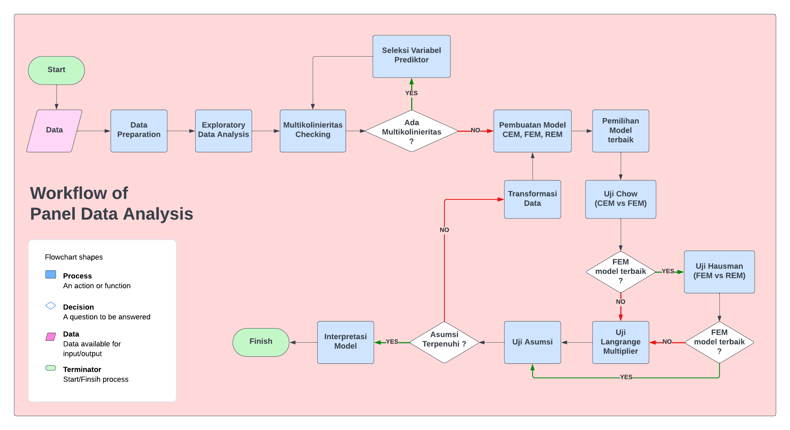

```{r setup, include=FALSE}
# clean up the environment
rm(list = ls())

# setup chunk options
knitr::opts_chunk$set(
  message = FALSE,
  warning = FALSE,
  cache = TRUE,
  fig.align = "center",
  comment = "#>"
)

options(scipen = 9999)
```

<style>
body {
text-align: justify}
</style>

## Setup Library/Package

```{r}
#Packages untuk pengolahan dataframe
library(dplyr)
library(tidyr)
library(lubridate)

#Packages untuk membuat visualisasi
library(ggcorrplot)
library(gplots)
library(ggplot2)
library(plotly)
library(foreign)

#Packages untuk melakukan analisis
library(plm)
library(lfe)
library(lmtest)
library(car)
library(tseries)
library(MLmetrics)
```

***

## Alur Kerja Data Panel

```{r, out.width = "100%", echo = FALSE, fig.align = "center"}

```


***

# Case Study Pemodelan Tingkat Kebahagiaan Beberapa Negara di Asia tenggara tahun 2006 s.d 2022

Asia Tenggara adalah wilayah yang kaya akan keragaman budaya, ekonomi, dan sosial. Negara-negara di kawasan ini telah mengalami perkembangan yang signifikan selama beberapa tahun terakhir, dengan perubahan ekonomi, demografis, dan politik yang berdampak pada kualitas hidup penduduk. Studi mengenai tingkat kebahagiaan di negara-negara Asia Tenggara menjadi semakin relevan seiring dengan pergeseran fokus dari pertumbuhan ekonomi semata menuju peningkatan kesejahteraan dan kualitas hidup. Dalam kerangka ini, analisis regresi data panel dapat memberikan wawasan mendalam tentang bagaimana berbagai faktor memengaruhi kebahagiaan di kawasan ini, dengan mempertimbangkan perbedaan antar negara serta evolusi hubungan tersebut dari waktu ke waktu, sejalan dengan indikator-indikator yang dipantau dalam World Happiness Report.

Sebagai data scientis kita diminta untuk menganalisis tingkat kebahagiaan beberapa negara di asia tenggara berdasarkan informasi socio demografi yang tersedia pada World Happiness Report.

## Data Preparation

Untuk menganalisis tingkat kebahagiaan beberapa negara di asia tenggara menggunakan data yang diperoleh dari World Happiness Report 2023 yang dipublish melalui kaggle oleh [USAMA BUTTAR](https://www.kaggle.com/datasets/usamabuttar/world-happiness-report-2005-present).

Berikut adalah beberapa informasi dari setiap kolom:

  + `Country.Name` : Informasi nama negara
  + `Regional.Indicator` : Informasi regional negara
  + `Year` : tahun
  + `Life.Ladder` : tingkat kebahagiaan [1-10]
  + `Log.GDP.Per.Capita` : Log Gross Domestic Product per orang di suatu negara
  + `Social.Support` : memiliki seseorang yang dapat diandalkan di saat-saat sulit.
  + `Healthy.Life.Expectancy.At.Birth` : 
  + `Freedom.To.Make.Life.Choices` : kebebasan untuk menentukan pilihan [0-1]
  + `Generosity` : seberapa sering seseorang mengeluarkan uang untuk donasi perbulan
  + `Perceptions.Of.Corruption` : Persepsi terhadap korupsi [0-1]
  + `Positive.Affect` : rata-rata ukuran efek hari sebelumnya untuk tawa, kesenangan, dan interest
  + `Negative.Affect` : rata-rata dari ukuran efek hari sebelumnya untuk kekhawatiran, kesedihan, dan kemarahan
  + `Confidence.In.National.Goverment` : seberapa percaya terhadap pemerintahan
  
***

Pada tahapan preparasi data ini akan dilakukan beberapa hal berikut:

1. Read data yang tersedia dalam folder `data_input` dengan nama `World_Happiness_Report.csv`
2. Mengambil data wilayah asia tenggara

```{r}
# 1. import dataset
df <- read.csv("data_input/World_Happiness_Report.csv")

# 2. mengambil data wilayah Central and Eastern Europe dan membuang kolom regional indikator
df_europe <- df %>% 
  filter(Regional.Indicator == "Central and Eastern Europe") %>% 
  select(-Regional.Indicator)


head(df_europe)
```


## Pemeriksaan Balancing Data
Untuk memeriksa apakah dta kita sudah balance dapat kita gunakan 2 cara yakni:

**1. Melihat frekuensi data berdasarkan index individu**

```{r}
# Your Code Here
table(df_europe$Country.Name)
```

**2. Menggunakan fungsi `is.pbalanced()` **

Untuk melakukannya dapat kita gunakan fungsi `is.pbalanced()` dengan catatan data dalam format pdata.frame. Apabila data belum dalam format pdata.frame, kita dapat menambahkan parameter `index("kolom individu", "kolom waktu")`. Hasil yang diharapkan dari pemeriksaannya adalah *TRUE* yang artinya data panel sudah seimbang.
```{r}
# Your Code Here
is.pbalanced(df_europe,index = c("Country.Name","Year"))
```
Dari hasil pemeriksaan frekuensi dan balancing data diatas terlihat bahwa:

- data belum seimbang
- negara yang memiliki informasi waktu lengkap adalah negara kamboja, indonesia, thailand dan vietnam
- negara dengan informasi waktu hilang paling banyak (7) adalah negara Montenegro, Slovakia

untuk selanjutnya negara laos dan myanmar tidak akan disertakan dalam pemodelan
```{r}
df_europe <- df_europe %>% filter(Country.Name %in% c("Lithuania", "Estonia", "Romania" ,"Hungary","Kosovo","Latvia", "Poland", "Albania","North Macedonia", "Croatia","Bosnia and Herzegovina","Bulgaria", "Serbia")) 
```

***

### Penyesuaian Struktur Data

**1. Membuat Panel Data Frame**

Agar data kita dapat melakukan balancing, kita perlu mengubah format data yang kita miliki menjadi sebuah panel data frame terlebih dahulu. Untuk memembuat panel data frame dapat kita lakukan dengan fungsi `pdata.frame()` dengan parameter:

- `data`  : data yang akan digunakan
- `index` : c("informasi individu","informasi waktu")

```{r}
#membuat pdata.frame
df_europe <- df_europe %>% pdata.frame(index = c("Country.Name","Year"))

#memeriksa struktur data
glimpse(df_europe)
```
Dengan pengubahan tipe data menjadi pdata.frame akan otomatis mengubah type data dari setiap kolom, 

- kolom yang dijadikan index akan bertipe factor
- selain kolom index akan menjadi pseries

**2. Mememeriksa Dimensi Data**

untuk memeriksa dimendi data panel dapat kita gunakan fungsi `pdim()`
```{r}
# Your Code Here
pdim(df_europe)
```
dari pemeriksaan dimensi data panel diatas dapat kita ketahui bahwa:

- data masih belum seimbang
- jumlah individu ada sebanyak 13 negara
- jumlah index waktu ada minimal 14 dan maksimal 17
- jumlah data keseluruhan ada sebanyak 200 observasi


***

### Balancing Data

Apabila data panel yang kita miliki tidak *balance* kita dapat melakukan balancing menggunakan fungsi `make.pbalanced` dengan parameter `balance.type` yang dapat diisi dengan 3 opsi berikut:

1. `fill` : untuk setiap kolom waktu yg hilang akan diberikan nilai NA
2. `shared.times` : akan diambil keseluruhan individu dgn ketentuan informasi waktu terdapat di semua individu
3. `shared.individuals` : akan individu dengan ketentuan informasi waktu lengkap

**1. Balancing menggunakan fill**
```{r}
# Your Code Here
balance1 <- df_europe %>% make.pbalanced(balance.type = "fill")

table(balance1$Country.Name)
unique(balance1$Year)
```

**2. Balancing menggunakan shared.times**
```{r}
# Your Code Here
balance2 <- df_europe %>% make.pbalanced(balance.type = "shared.times")

table(balance2$Country.Name)
unique(balance2$Year)
```

**3. Balancing menggunakan shared.individuals**
```{r}
# Your Code Here
balance3 <- df_europe %>% make.pbalanced(balance.type = "shared.individuals")

table(balance3$Country.Name)
unique(balance3$Year)
```
Berdasarkan kondisi data yang dimiliki, kita akan menggunakan data hasil balancing dengan metode `fill` untuk mendapatkan informasi paling optimal yang akan tersimpan pada objek bernama `balance1`.

```{r}
# Periksa kembali keseimbangan data
is.pbalanced(balance1)
```

```{r}
# pengecekan kembali dimensi data
pdim(balance1)

```
- data sudah seimbang
- jumlah individu ada sebanyak 13 negara
- jumlah index waktu ada 18
- jumlah data keseluruhan ada sebanyak 234 observasi


***

## Pemeriksaan Missing Value

sebelum kita periksa kelengkapan data kita perlu mengetahui berapa banyak informasi waktu yang ditambahkan dari tahapan sebelumnya 
```{r}
# jml missing data balance  - jml missing data unbalance
colSums(is.na(balance1)) - colSums(is.na(df_europe))
```
berdasarkan pemeriksaan diatas dapat diketahui bahwa dari data df_asia ketika dilakukan balancing terjadi penambahan 34 baris nilai NA untuk setiap kolom. 

Tahap selanjutnya adalah memeriksa kelengkapan data hasil balancing
```{r}
colSums(is.na(balance1))
```
Berdasarkan hasil pemeriksaan diatas kita melihat secara keseluruhan terdapat cukup banyak kolom yang memiliki nilai missing

- kolom Confidence.In.National.Government memiliki hampir 1/5 dari total data yang hilang
- maka tidak akan disertakan dalam pembuatan model

```{r}
# drop kolom yang tidak digunakan
balance1 <- balance1 %>% select(-Confidence.In.National.Government,Healthy.Life.Expectancy.At.Birth)
```


Untuk pemeriksaan dan melakukan pengisian nilai yang hilang maka akan dilakukan dengan cara interpolasi secara terpisah untuk setiap negara.

**1. Albania**

```{r}
# periksa nilai missing per negara
albania <- balance1 %>% filter(Country.Name == "Albania")

colSums(is.na(albania))
  
```
insight: terdapat missing untuk kolom

- Log.GDP.Per.Capita
- Freedom.To.Make.Life.Choices
- Positive.Affect
- Social.Support
- Generosity
- Negative.Affect
- Life.Ladder
- Healthy.Life.Expectancy.At.Birth
- Perceptions.Of.Corruption

untuk mengisi nilai yang hilang dengan nilai rata-rata dari nilai yang dekat dengan nilai missing menggunakan fungsi `na.fill()` dengan `fill = "extend"`
```{r}
# mengisi nilai missing 
albania <- albania %>% mutate(
  Log.GDP.Per.Capita = na.fill(Log.GDP.Per.Capita, fill = "extend"),
  Freedom.To.Make.Life.Choices = na.fill(Freedom.To.Make.Life.Choices, fill = "extend"),
  Positive.Affect = na.fill(Positive.Affect, fill = "extend"),
  Social.Support= na.fill(Social.Support, fill = "extend"),
  Generosity= na.fill(Generosity, fill = "extend"),
  Negative.Affect= na.fill(Negative.Affect, fill = "extend"),
  Life.Ladder= na.fill(Life.Ladder, fill = "extend"),
  Healthy.Life.Expectancy.At.Birth = na.fill(Healthy.Life.Expectancy.At.Birth, fill = "extend"),
  Perceptions.Of.Corruption = na.fill(Perceptions.Of.Corruption, fill = "extend"),
  )
  
anyNA(albania)
```

**2. Bosnia and Herzegovina **

```{r}
# periksa nilai missing per negara
bosnia <- balance1 %>% filter(Country.Name == "Bosnia and Herzegovina")

colSums(is.na(bosnia))
  
```
insight: insight: terdapat missing untuk kolom

- Log.GDP.Per.Capita
- Freedom.To.Make.Life.Choices
- Positive.Affect
- Social.Support
- Generosity
- Negative.Affect
- Life.Ladder
- Healthy.Life.Expectancy.At.Birth
- Perceptions.Of.Corruption

```{r}
# mengisi nilai missing 
bosnia <- bosnia %>% mutate(
  Log.GDP.Per.Capita = na.fill(Log.GDP.Per.Capita, fill = "extend"),
  Freedom.To.Make.Life.Choices = na.fill(Freedom.To.Make.Life.Choices, fill = "extend"),
  Positive.Affect = na.fill(Positive.Affect, fill = "extend"),
  Social.Support= na.fill(Social.Support, fill = "extend"),
  Generosity= na.fill(Generosity, fill = "extend"),
  Negative.Affect= na.fill(Negative.Affect, fill = "extend"),
  Life.Ladder= na.fill(Life.Ladder, fill = "extend"),
  Healthy.Life.Expectancy.At.Birth = na.fill(Healthy.Life.Expectancy.At.Birth, fill = "extend"),
  Perceptions.Of.Corruption = na.fill(Perceptions.Of.Corruption, fill = "extend"),
  )
  
anyNA(bosnia)
```

**3. Bulgaria**

```{r}
# periksa nilai missing per negara
bulgaria <- balance1 %>% filter(Country.Name == "Bulgaria")
colSums(is.na(bulgaria))
```
insight: terdapat missing untuk kolom

- Log.GDP.Per.Capita
- Freedom.To.Make.Life.Choices
- Positive.Affect
- Social.Support
- Generosity
- Negative.Affect
- Life.Ladder
- Healthy.Life.Expectancy.At.Birth
- Perceptions.Of.Corruption

```{r}
# mengisi nilai missing 
bulgaria <- bulgaria %>% mutate(
  Log.GDP.Per.Capita = na.fill(Log.GDP.Per.Capita, fill = "extend"),
  Freedom.To.Make.Life.Choices = na.fill(Freedom.To.Make.Life.Choices, fill = "extend"),
  Positive.Affect = na.fill(Positive.Affect, fill = "extend"),
  Social.Support= na.fill(Social.Support, fill = "extend"),
  Generosity= na.fill(Generosity, fill = "extend"),
  Negative.Affect= na.fill(Negative.Affect, fill = "extend"),
  Life.Ladder= na.fill(Life.Ladder, fill = "extend"),
  Healthy.Life.Expectancy.At.Birth = na.fill(Healthy.Life.Expectancy.At.Birth, fill = "extend"),
  Perceptions.Of.Corruption = na.fill(Perceptions.Of.Corruption, fill = "extend"))


anyNA(bulgaria)
```

**4. Croatia**

```{r}
# periksa nilai missing per negara
croatia <- balance1 %>% filter(Country.Name == "TCroatia")
colSums(is.na(croatia))
  
```
insight : tidak terdapat nilai missing untuk negara crotia


**5. Estonia**

```{r}
# periksa nilai missing per negara
estonia  <- balance1 %>% filter(Country.Name == "Estonia")
colSums(is.na(estonia))
```
insight: terdapat missing untuk kolom

- Log.GDP.Per.Capita
- Freedom.To.Make.Life.Choices
- Positive.Affect
- Social.Support
- Generosity
- Negative.Affect
- Life.Ladder
- Healthy.Life.Expectancy.At.Birth
- Perceptions.Of.Corruption

```{r}
#mengisi nilai missing
estonia <- estonia%>% mutate(
  Log.GDP.Per.Capita = na.fill(Log.GDP.Per.Capita, fill = "extend"),
  Freedom.To.Make.Life.Choices = na.fill(Freedom.To.Make.Life.Choices, fill = "extend"),
  Positive.Affect = na.fill(Positive.Affect, fill = "extend"),
  Social.Support= na.fill(Social.Support, fill = "extend"),
  Generosity= na.fill(Generosity, fill = "extend"),
  Negative.Affect= na.fill(Negative.Affect, fill = "extend"),
  Life.Ladder= na.fill(Life.Ladder, fill = "extend"),
  Healthy.Life.Expectancy.At.Birth = na.fill(Healthy.Life.Expectancy.At.Birth, fill = "extend"),
  Perceptions.Of.Corruption = na.fill(Perceptions.Of.Corruption, fill = "extend"))


anyNA(estonia)
```
insight: terdapat missing untuk kolom

- Log.GDP.Per.Capita
- Freedom.To.Make.Life.Choices
- Positive.Affect
- Social.Support
- Generosity
- Negative.Affect
- Life.Ladder
- Healthy.Life.Expectancy.At.Birth
- Perceptions.Of.Corruption

**6. Hungary**

```{r}
# periksa nilai missing per negara
hungary <- balance1 %>% filter(Country.Name == "Hungary")
colSums(is.na(hungary))
```
insight: terdapat missing untuk kolom

- Log.GDP.Per.Capita
- Freedom.To.Make.Life.Choices
- Positive.Affect
- Social.Support
- Generosity
- Negative.Affect
- Life.Ladder
- Healthy.Life.Expectancy.At.Birth
- Perceptions.Of.Corruption

```{r}
#mengisi nilai missing
hungary <- hungary%>% mutate(
  Log.GDP.Per.Capita = na.fill(Log.GDP.Per.Capita, fill = "extend"),
  Freedom.To.Make.Life.Choices = na.fill(Freedom.To.Make.Life.Choices, fill = "extend"),
  Positive.Affect = na.fill(Positive.Affect, fill = "extend"),
  Social.Support= na.fill(Social.Support, fill = "extend"),
  Generosity= na.fill(Generosity, fill = "extend"),
  Negative.Affect= na.fill(Negative.Affect, fill = "extend"),
  Life.Ladder= na.fill(Life.Ladder, fill = "extend"),
  Healthy.Life.Expectancy.At.Birth = na.fill(Healthy.Life.Expectancy.At.Birth, fill = "extend"),
  Perceptions.Of.Corruption = na.fill(Perceptions.Of.Corruption, fill = "extend"))


anyNA(hungary)
```
insight: terdapat missing untuk kolom

- Log.GDP.Per.Capita
- Freedom.To.Make.Life.Choices
- Positive.Affect
- Social.Support
- Generosity
- Negative.Affect
- Life.Ladder
- Healthy.Life.Expectancy.At.Birth
- Perceptions.Of.Corruption

**7. Kosovo**

```{r}
# periksa nilai missing per negara
kosovo <- balance1 %>% filter(Country.Name == "Kosovo")
colSums(is.na(kosovo))
  
```
insight: terdapat missing untuk kolom

- Log.GDP.Per.Capita
- Freedom.To.Make.Life.Choices
- Positive.Affect
- Social.Support
- Generosity
- Negative.Affect
- Life.Ladder
- Healthy.Life.Expectancy.At.Birth
- Perceptions.Of.Corruption

```{r}
kosovo <- kosovo%>% mutate(
  Log.GDP.Per.Capita = na.fill(Log.GDP.Per.Capita, fill = "extend"),
  Freedom.To.Make.Life.Choices = na.fill(Freedom.To.Make.Life.Choices, fill = "extend"),
  Positive.Affect = na.fill(Positive.Affect, fill = "extend"),
  Social.Support= na.fill(Social.Support, fill = "extend"),
  Generosity= na.fill(Generosity, fill = "extend"),
  Negative.Affect= na.fill(Negative.Affect, fill = "extend"),
  Life.Ladder= na.fill(Life.Ladder, fill = "extend"),
  Healthy.Life.Expectancy.At.Birth = na.fill(Healthy.Life.Expectancy.At.Birth, fill = "extend"),
  Perceptions.Of.Corruption = na.fill(Perceptions.Of.Corruption, fill = "extend"))


anyNA(kosovo)
```
**8. Latvia**

```{r}
# periksa nilai missing per negara
latvia <- balance1 %>% filter(Country.Name == "Latvia")
colSums(is.na(latvia))
  
```
insight: terdapat missing untuk kolom

- Log.GDP.Per.Capita
- Freedom.To.Make.Life.Choices
- Positive.Affect
- Social.Support
- Generosity
- Negative.Affect
- Life.Ladder
- Healthy.Life.Expectancy.At.Birth
- Perceptions.Of.Corruption

```{r}
latvia <- latvia%>% mutate(
  Log.GDP.Per.Capita = na.fill(Log.GDP.Per.Capita, fill = "extend"),
  Freedom.To.Make.Life.Choices = na.fill(Freedom.To.Make.Life.Choices, fill = "extend"),
  Positive.Affect = na.fill(Positive.Affect, fill = "extend"),
  Social.Support= na.fill(Social.Support, fill = "extend"),
  Generosity= na.fill(Generosity, fill = "extend"),
  Negative.Affect= na.fill(Negative.Affect, fill = "extend"),
  Life.Ladder= na.fill(Life.Ladder, fill = "extend"),
  Healthy.Life.Expectancy.At.Birth = na.fill(Healthy.Life.Expectancy.At.Birth, fill = "extend"),
  Perceptions.Of.Corruption = na.fill(Perceptions.Of.Corruption, fill = "extend"))


anyNA(latvia)
```
**9. Lithuania**

```{r}
# periksa nilai missing per negara
lithuania <- balance1 %>% filter(Country.Name == "Lithuania")
colSums(is.na(lithuania))
  
```
insight: terdapat missing untuk kolom

- Log.GDP.Per.Capita
- Freedom.To.Make.Life.Choices
- Positive.Affect
- Social.Support
- Generosity
- Negative.Affect
- Life.Ladder
- Healthy.Life.Expectancy.At.Birth
- Perceptions.Of.Corruption

```{r}
lithuania <- lithuania%>% mutate(
  Log.GDP.Per.Capita = na.fill(Log.GDP.Per.Capita, fill = "extend"),
  Freedom.To.Make.Life.Choices = na.fill(Freedom.To.Make.Life.Choices, fill = "extend"),
  Positive.Affect = na.fill(Positive.Affect, fill = "extend"),
  Social.Support= na.fill(Social.Support, fill = "extend"),
  Generosity= na.fill(Generosity, fill = "extend"),
  Negative.Affect= na.fill(Negative.Affect, fill = "extend"),
  Life.Ladder= na.fill(Life.Ladder, fill = "extend"),
  Healthy.Life.Expectancy.At.Birth = na.fill(Healthy.Life.Expectancy.At.Birth, fill = "extend"),
  Perceptions.Of.Corruption = na.fill(Perceptions.Of.Corruption, fill = "extend"))


anyNA(lithuania)
```
**10. North Macedonia **

```{r}
# periksa nilai missing per negara
macedonia <- balance1 %>% filter(Country.Name == "North Macedonia")
colSums(is.na(macedonia))
  
```
insight: terdapat missing untuk kolom

- Log.GDP.Per.Capita
- Freedom.To.Make.Life.Choices
- Positive.Affect
- Social.Support
- Generosity
- Negative.Affect
- Life.Ladder
- Healthy.Life.Expectancy.At.Birth
- Perceptions.Of.Corruption

```{r}
macedonia <- macedonia%>% mutate(
  Log.GDP.Per.Capita = na.fill(Log.GDP.Per.Capita, fill = "extend"),
  Freedom.To.Make.Life.Choices = na.fill(Freedom.To.Make.Life.Choices, fill = "extend"),
  Positive.Affect = na.fill(Positive.Affect, fill = "extend"),
  Social.Support= na.fill(Social.Support, fill = "extend"),
  Generosity= na.fill(Generosity, fill = "extend"),
  Negative.Affect= na.fill(Negative.Affect, fill = "extend"),
  Life.Ladder= na.fill(Life.Ladder, fill = "extend"),
  Healthy.Life.Expectancy.At.Birth = na.fill(Healthy.Life.Expectancy.At.Birth, fill = "extend"),
  Perceptions.Of.Corruption = na.fill(Perceptions.Of.Corruption, fill = "extend"))


anyNA(macedonia)

```
**11. Poland **

```{r}
# periksa nilai missing per negara
poland <- balance1 %>% filter(Country.Name == "Poland")
colSums(is.na(poland))
  
```
insight: terdapat missing untuk kolom

- Log.GDP.Per.Capita
- Freedom.To.Make.Life.Choices
- Positive.Affect
- Social.Support
- Generosity
- Negative.Affect
- Life.Ladder
- Healthy.Life.Expectancy.At.Birth
- Perceptions.Of.Corruption

```{r}
poland <- poland%>% mutate(
  Log.GDP.Per.Capita = na.fill(Log.GDP.Per.Capita, fill = "extend"),
  Freedom.To.Make.Life.Choices = na.fill(Freedom.To.Make.Life.Choices, fill = "extend"),
  Positive.Affect = na.fill(Positive.Affect, fill = "extend"),
  Social.Support= na.fill(Social.Support, fill = "extend"),
  Generosity= na.fill(Generosity, fill = "extend"),
  Negative.Affect= na.fill(Negative.Affect, fill = "extend"),
  Life.Ladder= na.fill(Life.Ladder, fill = "extend"),
  Healthy.Life.Expectancy.At.Birth = na.fill(Healthy.Life.Expectancy.At.Birth, fill = "extend"),
  Perceptions.Of.Corruption = na.fill(Perceptions.Of.Corruption, fill = "extend"))


anyNA(poland)

```
**12. Romania **

```{r}
# periksa nilai missing per negara
romania <- balance1 %>% filter(Country.Name == "Romania")
colSums(is.na(romania))
  
```
insight: terdapat missing untuk kolom

- Log.GDP.Per.Capita
- Freedom.To.Make.Life.Choices
- Positive.Affect
- Social.Support
- Generosity
- Negative.Affect
- Life.Ladder
- Healthy.Life.Expectancy.At.Birth
- Perceptions.Of.Corruption

```{r}
romania <- romania%>% mutate(
  Log.GDP.Per.Capita = na.fill(Log.GDP.Per.Capita, fill = "extend"),
  Freedom.To.Make.Life.Choices = na.fill(Freedom.To.Make.Life.Choices, fill = "extend"),
  Positive.Affect = na.fill(Positive.Affect, fill = "extend"),
  Social.Support= na.fill(Social.Support, fill = "extend"),
  Generosity= na.fill(Generosity, fill = "extend"),
  Negative.Affect= na.fill(Negative.Affect, fill = "extend"),
  Life.Ladder= na.fill(Life.Ladder, fill = "extend"),
  Healthy.Life.Expectancy.At.Birth = na.fill(Healthy.Life.Expectancy.At.Birth, fill = "extend"),
  Perceptions.Of.Corruption = na.fill(Perceptions.Of.Corruption, fill = "extend"))


anyNA(romania)

```
**13. Serbia **

```{r}
# periksa nilai missing per negara
serbia <- balance1 %>% filter(Country.Name == "Serbia")
colSums(is.na(serbia))
  
```
insight: terdapat missing untuk kolom

- Log.GDP.Per.Capita
- Freedom.To.Make.Life.Choices
- Positive.Affect
- Social.Support
- Generosity
- Negative.Affect
- Life.Ladder
- Healthy.Life.Expectancy.At.Birth
- Perceptions.Of.Corruption

```{r}
serbia <- serbia%>% mutate(
  Log.GDP.Per.Capita = na.fill(Log.GDP.Per.Capita, fill = "extend"),
  Freedom.To.Make.Life.Choices = na.fill(Freedom.To.Make.Life.Choices, fill = "extend"),
  Positive.Affect = na.fill(Positive.Affect, fill = "extend"),
  Social.Support= na.fill(Social.Support, fill = "extend"),
  Generosity= na.fill(Generosity, fill = "extend"),
  Negative.Affect= na.fill(Negative.Affect, fill = "extend"),
  Life.Ladder= na.fill(Life.Ladder, fill = "extend"),
  Healthy.Life.Expectancy.At.Birth = na.fill(Healthy.Life.Expectancy.At.Birth, fill = "extend"),
  Perceptions.Of.Corruption = na.fill(Perceptions.Of.Corruption, fill = "extend"))


anyNA(serbia)

```

Setelah semua negara tidak lagi terdapat nilai yang missing, selanjutnya kita akan gabungkan kembali dan akan disimpan pada objek dengan nama balanced2

```{r}
# Your Code Here
balanced2 <- bind_rows(albania,bosnia,bulgaria,croatia,estonia,hungary,latvia,lithuania,macedonia,poland,romania,serbia) 
```


Pemeriksaan Kembali keseimbangan data
```{r}
# Your Code Here
pdim(balanced2)
```

Pemeriksaan Kembali kelengkapan data
```{r}
# Your Code Here
colSums(is.na(balanced2))
```

Data telah siap untuk digunakan pada tahapan selanjutnya

## Exploratory Data Analysis

### Ringkasan Data

```{r}
summary(balanced2)
```
Berdasarkan ringkasan diatas dapat kita ketahui beberapa hal berikut:

- tingkat kebahagiaan tertinggi *di beberapa negara di Central and Eastern Europe* adalah 7.038
- tingkat kebahagiaan terrendah *di beberapa negara di Central and Eastern Europe* adalah 3.844


### Hubungan Antar Variabel

Untuk mengetahui seberapa besar tingkat hubungan antar variabel prediktor terhadap variabel target, dapat kita gunakan fungsi `ggcorrplot`.
```{r}
# Your Code Here
balanced2 %>% select(-Country.Name, -Year) %>% cor() %>% ggcorrplot(type = "lower", lab = TRUE)
```
Berdasarkan hasil plot heatmap diatas, dapat diketahui bahwa 

- Variabel yang memiliki Hubungan Kuat terhadap Life.Ladder adalah:
  - Social.Support
  - Log.GDP.Per.Capita
  - Freedom.To.Make.Life.Choices
  - Healthy.Life.Expectancy.At.Birth
  - Positif Affect

- Terdapat indikasi multikolinieritas antara
  - Log.GDP.Per.Capita dengan Freedom.To.Make.Life.Choices

### Explorasi Socio demografi

Untuk melihat lebih dalam informasi dari data yang kita miliki dapat kita lakukan dengan menggunakan fungsi `coplot()` dengan parameter

- `formula` = diisikan dengan target ~ index1 given index2 
- `type`    = `"l"` untuk line dan `"b"` untuk point & line plot
- `data`    = dataset
- `rows`    = banyaknya baris panel plot yang dibuat
- `col`     = warna plot yang disajikan

**1. Life.ladder**

```{r}
# Your Code Here
coplot(Life.Ladder ~ Year|Country.Name,
       type = "b",
       data = balanced2,
       rows = 1,
       col = "red")

```
Berdasarkan Line plot diatas dapat kita ketahui bahwa :

- secara keseluruhan warga negara yang merasa paling bahagia *di beberapa negara di Central and Eastern Europe* adalah warga negara Lithuania
- secara keseluruhan warga negara yang merasa tingkat kebahagiaan *di beberapa negara di Central and Eastern Europe* paling rendah adalah warga negara Bulgaria

**2. Log.GDP.Per.Capita**

```{r}
# Your Code Here
coplot(Log.GDP.Per.Capita ~ Year|Country.Name,
       type = "b",
       data = balanced2,
       rows = 1,
       col = "red")
```

Berdasarkan plot diatas dapat kita ketahui bahwa :

- Log Gross Domestic Product per orang di suatu negara yaitu Lithuania

**3. Social.Support**
```{r}
# Your Code Here
coplot(Social.Support ~ Year|Country.Name,
       type = "b",
       data = balanced2,
       rows = 1,
       col = "red")

```
Berdasarkan plot diatas dapat kita ketahui bahwa :

- seseorang yang dapat diandalkan di saat keadaan sulit adalah negara Lithuania


**4. Perceptions.Of.Corruption**
```{r}
# Perceptions.Of.Corruption
# Your Code Here
coplot(Perceptions.Of.Corruption ~ Year|Country.Name,
       type = "b",
       data = balanced2,
       rows = 1,
       col = "red")
```
Berdasarkan Line plot diatas dapat kita ketahui bahwa :

- Estonia dengan tingkat persepsi korupsi terendah
- Romania dengan tingkat persepsi korupsi tertinggi


### [Additional] Heterogenitas Life.Ledder

Untuk melihat heterogenitas antar individu dan waktu kita dapat menggunakan fungsi `plotmeans()` dari package gplots dengan parameter:

- formula : Target ~ variabel index individu/waktu
- data    : data frame 

**1. Heterogenitas antar negara**
```{r}
plotmeans( Life.Ladder ~ Country.Name, data = balanced2, main="Heterogenitas Life.Ladder antar Negara")
```
Insight : Berdasarkan hasil visual diatas terlihat bahwa data antar negara cukup heterogen
    

**2. Heterogenitas antar Waktu**
```{r}
plotmeans(Life.Ladder ~ Year, data = balanced2, main="Heterogenitas Life.Ladder antar Tahun")
```
Insight : Berdasarkan hasil visual diatas terlihat bahwa data antar tahun cukup naik

  
***

## Pemodelan

### Cross-Validation
Tahapan cross validation akan selalu dilakukan sebelum pembuatan model, data akan dibagi menjadi data train dan data test. Dikarenakan data panel memiliki informasi keterangan waktu maka pembagian data tidak boleh diambil secara acak melainkan dibagi dengan cara dipisah secara berurutan.

- Data Train akan menggunakan data yang terlampau
- Data Test akan menggunakan data yang terbaru

untuk melakukannya kita bisa menggunakan bantuan fungsi `filter()`

```{r}
#membuat data train
ladder_train <- balanced2 %>% filter(Year != 2022) 
  
#membuat data test
ladder_test <- balanced2 %>% filter(Year == 2022)
```

setelah dilakukan cross validation kita perlu memastikan kembali bahwa data train sudah balance dengan melakukan balancing

```{r}
ladder_train <- ladder_train %>% 
  droplevels() %>%    # menghapus informasi waktu yang diambil sebagai data test (tahun 2022)
  make.pbalanced()    # melakukan balancing kembali

is.pbalanced(ladder_train)
```

***

### Pemeriksaan Asumsi Multikolinieritas
Dikarenakan pada hasil pemeriksaan korelasi pada tahapan EDA sebelumnya menunjukkan adanya indikasi multikolinieritas antar variabel prediktor, maka akan dilakukan pemeriksaan asumsi multikolinieritas terlebih dahulu dengan cara pembuatan model regresi dengan fungsi `lm()` dan dilanjutkan pengujian menggunakan fungsi `vif()`.

nilai VIF > 10: terjadi multicollinearity pada model
nilai VIF < 10: tidak terjadi multicollinearity pada model

```{r}
# your code here
lm(Life.Ladder ~ .-Country.Name -Year, ladder_train) %>% vif()
```
Insight: untuk tahapan pemodelan selanjutnya kita tidak akan menyertakan kolom Healthy.Life.Expectancy.At.Birth, 
Generosity
***

### Penentuan Model Estimasi

#### Pembuatan Model
Untuk setiap pembuatan model akan digunakan fungsi `plm()` dari package plm dengan parameter sebagai berikut:

- `formula` = Target ~ Prediktor
- `data`    = berupa dataframe
- `index`   = c("kolom_individu","kolom_waktu")
- `model`   =
  + `"pooling"` : untuk model CEM
  + `"within"`  : untuk model FEM
  + `"random"`  : untuk model REM

dimana 

- Variabel target : Life.Ladder
- Variabel prediktor :  
  + Log.GDP.Per.Capita
  + Positive.Affect
  + Social.Support
  + Perceptions.Of.Corruption


**Model Gabungan (CEM)**

membuat Common effect model dan disimpan kedalam objek `cem`

```{r}
# membuat Common effect model 
cem <- plm(Life.Ladder ~ Log.GDP.Per.Capita + Social.Support + Perceptions.Of.Corruption + Positive.Affect, 
           data = ladder_train,
           index = c("Country.Name","Year"),
           model = "pooling")
```

**Model Pengaruh Tetap (FEM)**

membuat model FEM dengan memberikan parameter tambahan `effect = "twoways"` untuk memasukan pengaruh individu dan waktu, kemudian disimpan kedalam objek `fem.two`

```{r}
# membuat fixed effect model 
fem <- plm(Life.Ladder ~ Log.GDP.Per.Capita + Social.Support + Perceptions.Of.Corruption + Positive.Affect, 
           data = ladder_train,
           index = c("Country.Name","Year"),
           model = "within")

```

**Uji Chow**

Uji chow dilakukan untuk memilih model terbaik antara model gabungan (cem) dengan model fixed effec (fem). untuk melakukan uji Chow dapat menggunakan fungsi `pooltest(model_cem, model_fem)`

Hipotesis yang diuji adalah sebagai berikut:

- H0 : Model gabungan
- H1 : Model pengaruh tetap

H0 ditolak jika P-value < α. Nilai α yang digunakan sebesar 5%.
```{r}
# your code here
pooltest(cem,fem)
```
Berdasarkan hasil uji chow diatas, kita peroleh nilai p-value < α. artinya Model terbaik untuk digunakan pada data World Happines adalah fixed effect model.

***

**Model Pengaruh Acak (REM)**

membuat random effect model dan disimpan kedalam objek `rem`
```{r}
# membuat random effect model 
rem <- plm(Life.Ladder ~ Log.GDP.Per.Capita + Social.Support + Perceptions.Of.Corruption + Positive.Affect, 
           data = ladder_train,
           index = c("Country.Name","Year"),
           model = "random")

```


**Uji Hausman**

Untuk melakukan uji Chow di R dapat menggunakan fungsi `phtest(model_rem, model_fem)`, dengan Hipotesis yang diuji adalah sebagai berikut. 

- H0 : Model pengaruh acak
- H1 : Model pengaruh tetap

Keputusan tolak H0 (model pengaruh tetap terpilih) apabila nilai p-value < α.

```{r}
# your code here
phtest(rem,fem)
```
Berdasarkan hasil uji hausman diatas, kita peroleh nilai p-value < α. artinya Model terbaik untuk digunakan pada data World Happines adalah *fixed effect model*. Dikarenakan model fem adalah model terbaik maka tidak perlu dilakukan uji efek lanjutan, dan bisa langsung dilakukan pengujian asumsi.

***

#### Pengujian Asumsi

**Normalitas**

Hipotesis yang diuji adalah sebagai berikut.

- H0 : Sisaan menyebar normal
- H1 : Sisaan tidak menyebar normal

H0 ditolak jika P-value < α. Nilai α yang digunakan sebesar 5%.
```{r}
# your code here
fem$residuals %>% shapiro.test()
```

Berdasarkan hasil pengujian normalitas sisaan diperoleh nilai p-value > 0.05, artinya sisaan menyebar secara normal.

**Homogenitas**

Hipotesis yang diuji adalah sebagai berikut.

- H0 : Sisaan memiliki ragam homogen
- H1 : Sisaan tidak memiliki ragam homogen

H0 ditolak jika P-value < α. Nilai α yang digunakan sebesar 5%.
```{r}
# your code here
fem %>% bptest()
```
Berdasarkan hasil pengujian homogenitas diperoleh nilai p-value > 0.05, artinya sisaan memiliki ragam yang homogen.

**Autokorelasi**

Hipotesis yang diuji adalah sebagai berikut.

- H0 : tidak terjadi autokorelasi pada sisaan
- H1 : terjadi autokorelasi pada sisaan

H0 ditolak jika P-value < α. Nilai α yang digunakan sebesar 5%.
```{r}
# your code here
fem$residuals %>% Box.test(type = "Ljung-Box")
```
Berdasarkan hasil pengujian autokorelasi diperoleh nilai p-value < 0.05, artinya terjadi permasalahan autokorelasi antar sisaan.

***

### Interpretasi Model

**1. Koefisien**
```{r}
# your code here
summary(fem)
```
Interpretasi: 

$$life.ladder = 1.77038 * Log.GDP.Per.Capita +  3.81032 * Social.Support - -0.89491 Perceptions.Of.Corruption - 1.88803 Negative.Affect + uit$$

- variabel yang signifikan mempengaruhi tingkat kebahagiaan masyarakat di suatu negara adalah :
  + Log.GDP.Per.Capita
  + Social.Support
  + Positive.Affect
- dari kedua variabel yang signifikan, Social.support memberikan pengaruh yang lebih besar dibandingkan dengan log.gdp
- tingkat kebahagian masyarakat di suatu negara akan bertambah sebesar 1.77038 untuk setiap kenaikan 1 satuan Log.GDP.Per.Capita, dengan catatan variabel lainnya bernilai tetap
- tingkat kebahagian masyarakat di suatu negara akan bertambah sebesar 3.81032  untuk setiap kenaikan 1 satuan Social.Support, dengan catatan variabel lainnya bernilai tetap
- tingkat kebahagian masyarakat di suatu negara akan menurun sebesar -0.89491 untuk setiap kenaikan 1 satuan Perceptions.Of.Corruption, dengan catatan variabel lainnya bernilai tetap
- tingkat kebahagian masyarakat di suatu negara akan meningkat sebesar 1.88803  untuk setiap kenaikan 1 satuan Positive.Affect , dengan catatan variabel lainnya bernilai tetap

**2. Mengekstrak informasi Efek dari model fix**

Untuk mengekstrak informasi efek dari model FEM kita dapat menggunakan fungsi `fixef(model fem)`,
```{r}
# your code here
fixef(fem)
```
Interpretasi:

- tingkat kebahagiaan masyarakat di negara Albania adalah sebesar -14.595 apabila tidak terdapat informasi lainnya
- tingkat kebahagiaan masyarakat di negara Hungary adalah sebesar -16.552 apabila tidak terdapat informasi lainnya
- tingkat kebahagiaan masyarakat di negara Poland adalah sebesar -16.042 apabila tidak terdapat informasi lainnya
- tingkat kebahagiaan masyarakat di negara Bosnia and Herzegovina adalah sebesar -14.582 apabila tidak terdapat informasi lainnya
- tingkat kebahagiaan masyarakat di negara Latvia adalah sebesar -16.259  apabila tidak terdapat informasi lainnya
- tingkat kebahagiaan masyarakat di negara Romania adalah sebesar -15.428 apabila tidak terdapat informasi lainnya
- tingkat kebahagiaan masyarakat di negara Bulgaria adalah sebesar -16.545 apabila tidak terdapat informasi lainnya
- tingkat kebahagiaan masyarakat di negara Lithuania and Herzegovina adalah sebesar -16.047 apabila tidak terdapat informasi lainnya
- tingkat kebahagiaan masyarakat di negara Serbia adalah sebesar -15.197  apabila tidak terdapat informasi lainnya
- tingkat kebahagiaan masyarakat di negara Estonia adalah sebesar -16.785 apabila tidak terdapat informasi lainnya
- tingkat kebahagiaan masyarakat di negara North Macedonia  adalah sebesar -15.315 
 apabila tidak terdapat informasi lainnya


***

### Prediksi & Evaluasi
Untuk melakukan prediksi akan kita gunakan fungsi `predict()`
dengan parameter:

- object = nama model yang kita gunakan
- newdata = data baru yang akan kita prediksi

```{r}
# your code here
pred <- predict(fem, ladder_test, na.fill = F)
```
Untuk menguji apakah model yang kita miliki sudah baik dalam memprediksi data baru maka kita akan evaluasi dengan menggunakan nilai error, salah satu metric eror yang biasa digunakan adalah MAPE. Kita dapat melakukannya menggunakan fungsi `MAPE()` dengan parameter:

- y_pred =  nilai hasil prediksi
- y_true =  nilai target asli

```{r}
# your code here
MAPE(y_pred = pred,
     y_true = ladder_test$Life.Ladder)
```
Insight: tingkat kesalahan prediski model fem dalam memprediksi nilai baru tidak ada NA
***


# Kesimpulan

Dari serangkaian proses analisis yang telah dilakukan, dapat kita peroleh kesimpulan sebagai berikut:

- tingkat kebahagiaan masyarakat tertinggi di *EROPA* adalah di negara Lithuania
- tingkat kebahagiaan masyarakat terrendah di *EROPA* adalah di negara Bulgaria
- terdapat multikolineritas variabel antara Log.GDP.Per.Capita dengan Freedom.To.Make.Life.Choices, hal ini mengindikasikan bahwa nilai keduanya bersifat redundan. sehingga pada pemodelan kita bisa memilih salah satu dari keduanya untuk dijadikan variabel prediktor
- variabel yang signifikan mempengaruhi tingkat kebahagiaan masyarakan di suatu negara adalah Log.GDP.Per.Capita,
  ,Social.Support dan Positive.Affect
- dari ketiga variabel yang signifikan tersebut, social support memberikan pengaruh yang lebih besar terhadap tingkat kebahagaiaan masyarakat di suatu negara
- dari model final, kita ketahui bahwa index individu memberikan pengaruh terhadap tingkat kebahagiaan masyarakat. yang artinya setiap negara memiliki karakteristik yang berbeda mengenai tingkat kebahagiaan masyarakatnya
- tidak terdapat efek waktu terhadap tingkat kebahagiaan masyarakat di suatu negara di wilayah *EROPA*
